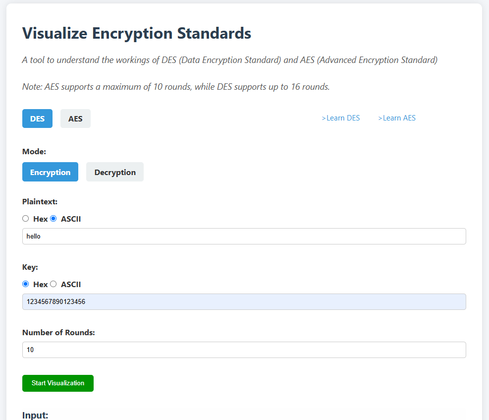
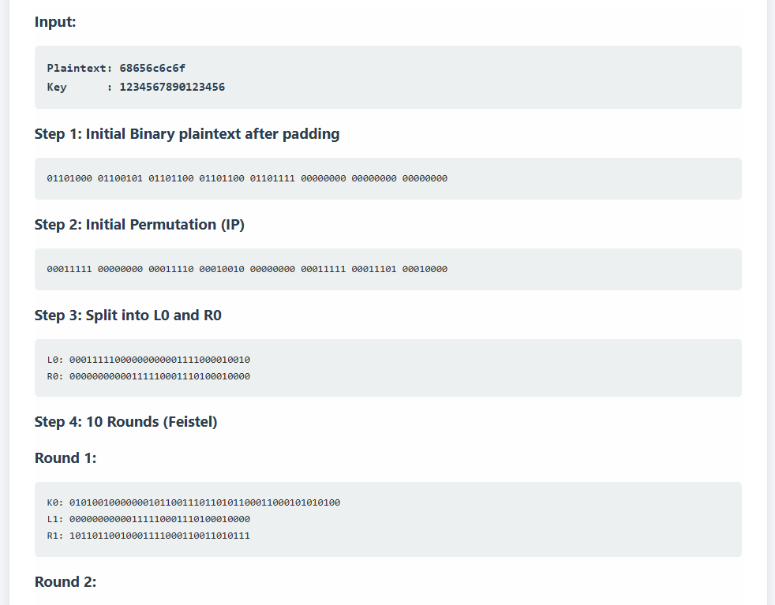
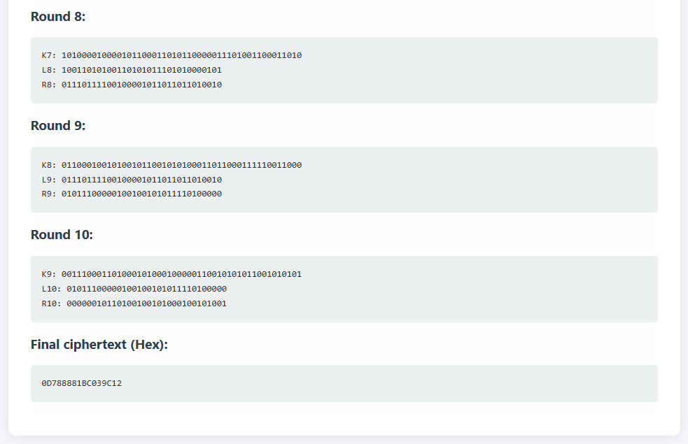
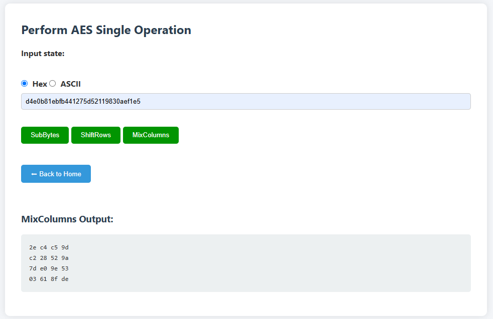

## Encryption Standards Visualizer

**Encryption Standards Visualizer** is an interactive web-based tool that demonstrates the internal workings of two fundamental cryptographic algorithms: **AES (Advanced Encryption Standard)** and **DES (Data Encryption Standard)**. This project is designed to aid students, educators, and security enthusiasts in visualizing each transformation that takes place during encryption and decryption.
Access it [here](https://pranaysinganalli.github.io/cryptographic-encryption-standards-visualizer/)
---

## 📸 Preview

Isolated AES operations:

---

##  Features

-  **Supports both AES and DES** encryption and decryption  
-  **Step-by-step visualization** of rounds and transformations  
-  **AES Single Operation Mode** (SubBytes, ShiftRows, MixColumns)  
-  Input support for **ASCII** and **Hexadecimal** formats  
-  Adjustable number of rounds (AES: 1–10, DES: 1–16)  
-  Real-time error validation and user feedback  
-  Educational tool for better understanding cryptographic processes  
-  Fully browser-based – no installation required  

---

## 🛠️ Usage

1. **Select an Algorithm**  
   Choose between **AES** and **DES** by toggling the selection on the homepage.

2. **Enter Plaintext and Key**  
   Provide your input in either **Hexadecimal** or **ASCII** format. The tool will automatically convert and pad values if needed.

3. **Set Mode: Encryption or Decryption**  
   Choose the desired operation mode using the toggle provided.

4. **Specify Number of Rounds**  
   - **AES** supports up to **10 rounds**.  
   - **DES** supports up to **16 rounds**.

5. **Click "Start Visualization"**  
   Watch a detailed, step-by-step breakdown of the encryption or decryption process.

6. **(Optional) Use Single Operation Mode (AES)**  
   Click on “Perform a single AES operation” to explore operations like:
   - `SubBytes`
   - `ShiftRows`
   - `MixColumns`

7. **Visual Output Section**  
   Scroll down to see intermediate results like state matrices, round keys, and final outputs in **hex** and **ASCII** formats.

> ⚠️ Input Validation:  
> The tool checks for invalid inputs (e.g., non-hex characters or incorrect key lengths) and alerts you with helpful messages.

